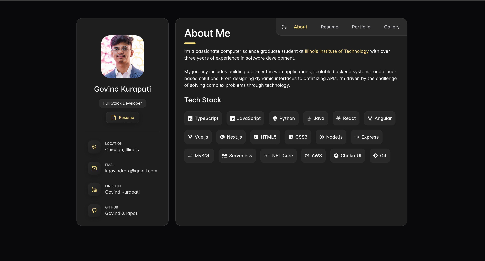

# Govind Kurapati | Portfolio

A modern, responsive portfolio showcasing my experience, projects, technical
skills, education, and certifications as a software engineer and full-stack
developer.

[View the live portfolio](https://govind-kurapati.com)

## Preview

### Highlights

- About page with a visual overview of my technical stack
- Professional experience, education, and volunteer work timeline
- Project gallery with technology details and external links
- Certification gallery with expanded previews
- Responsive layouts for desktop and mobile devices
- Light and dark color modes
- Keyboard-accessible command palette with `Ctrl/Command + K`

## Tech Stack

| Category     | Technologies                          |
| ------------ | ------------------------------------- |
| Framework    | Next.js 15, React 19                  |
| UI           | Chakra UI, Emotion, React Icons       |
| Animation    | Framer Motion                         |
| Navigation   | KBar command palette                  |
| Theming      | Next Themes                           |
| Analytics    | Umami                                 |
| Integrations | Spotify API, Literal.club GraphQL API |

## Connect

- [LinkedIn](https://linkedin.com/in/govind-kurapati)
- [GitHub](https://github.com/GovindKurapati)
- [Email](mailto:kgovindrarg@gmail.com)
